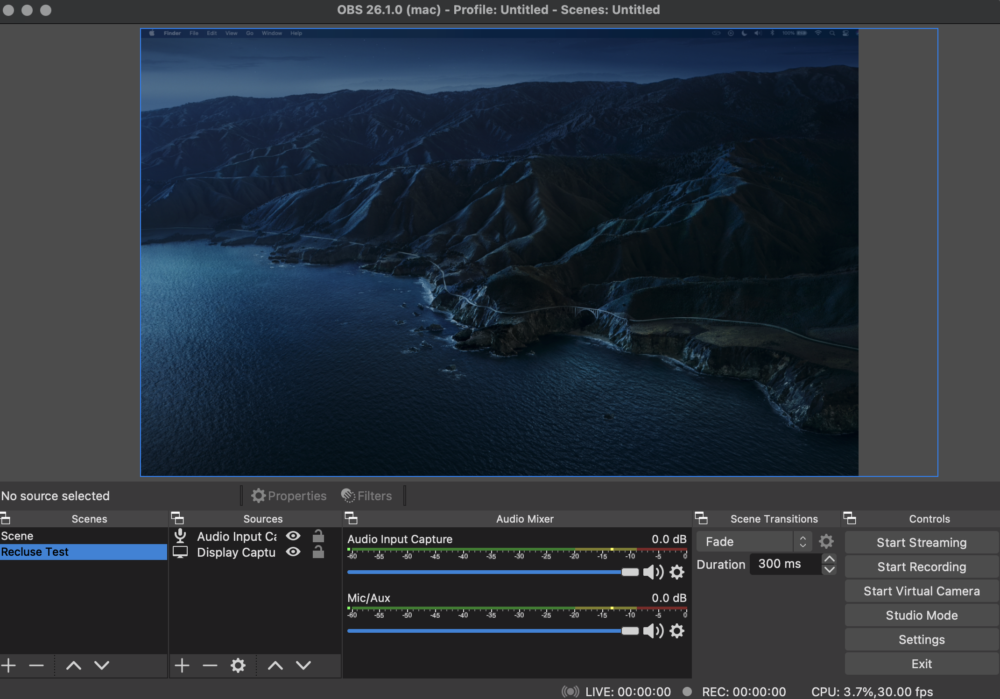
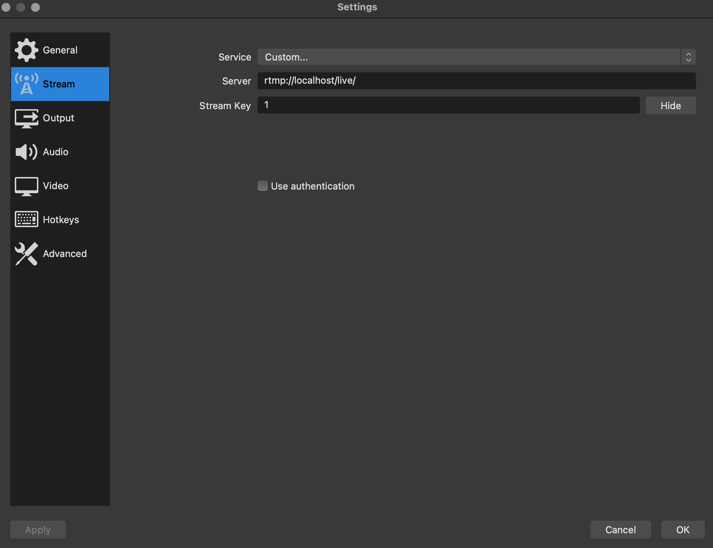

# Recluse Stream

Recluse Stream is a single-page streaming web app developed with the [React](https://reactjs.org/), [Node](https://nodejs.org/en/), [Redux](https://redux.js.org/) javascript frameworks, and a variety of other dependencies

[](https://app.netlify.com/sites/recluse-stream/deploys)

## Features

Recluse allows you to stream from popular streaming and recording service [OBS](https://obsproject.com/) to the web app directly through the [Node Media Server](https://github.com/illuspas/Node-Media-Server), a popular backend Node powered video streaming service and with a MongoDB-clone JSON database.

It also integrates Google OAuth and allows the user to login using their Google account.

## Use

### Requirements

The Node framework is required, use [Homebrew](https://brew.sh/)

```bash
brew install node
```

or download it directly [here](https://nodejs.org/en/download/)

From there clone the Recluse Stream repository found [here](https://github.com/collinpfeifer/RecluseStream) and navigate to the directory

```bash
cd where/the/directory/lives
```

an example:

```bash
cd Users/User/Downloads/RecluseStream
```

once inside the directory, navigate to the front end and install node_modules and start the React server

```bash
cd RecluseStream/front
npm install
npm start
```

From there, both the API server and RTMP server must be started, this can be done through navigating to the back end

```bash
cd RecluseStreams/back
```

and going into both directories and starting the servers

```bash
cd back/rtmpserver
npm start
```

```bash
cd back/apiserver
npm start
```

and it now should open a window in your preferred internet browser where the web application is viewable

## OBS Setup
To begin streaming video to the site, you must have OBS installed and a stream created on Recluse.

Firstly make sure you have a scene made with an audio input capture and a screen capture, you can do this by clicking the plus button in the bottom left corner of the scenes tab and making a new one and naming it. Once inside of the newly created scene, you should hit the plus button in the bottom left corner of the sources tab to add the audio and screen capture, as displayed here:



Then navigate to your browser and go to Recluse Stream, next log in with Google and create a stream with the "Create Stream" button. From there, most likely that will be the only stream created, and so the id of the stream will be 1, but if not, make sure to remember what the id of your stream is. You can check the id of the stream by going to db.json inside of apiserver and finding the name of your stream.

Finally go back to OBS and go into settings or preferences and the stream setting as displayed here:



Change the service to custom, the server should be labeled as rtmp://localhost/live and then the stream key should be the id of your stream.

Navgiate back to the main screen and click "Start Streaming" to begin streaming to the app.
## Support

If there are any issues or potential changes open an issue and changes can be discussed

## Roadmap

Later on down the road I will probably come back and added more unique features and better security and authentication for streaming

## Contributions

Contributions are welcome but again I'd rather have an issue be opened before any contributions

## License
Recluse Stream has an [MIT License](https://opensource.org/licenses/MIT)
